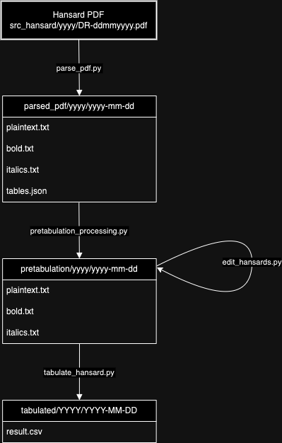

This project aims to digitalise the Malaysian [Dewan Rakyat](https://www.parlimen.gov.my/hansard-dewan-rakyat.html?uweb=dr&) and [Dewan Negara](https://www.parlimen.gov.my/hansard-dewan-negara.html?uweb=dn&) Hansards.

## Usage
1. Install requirements `pip install -r requirements.txt`
2. Bulk process with `python3 batch_run.py` (check the file and uncomment the wanted processes as this is still in active development)



To be specific, these files will be run in order.

Run `parse_pdf.py` to get the four output files of plaintext, binary bold and italic files (as 0, 1, or whitespaces) and tables.json. The parsing will only process the content from DOA onwards (ignores table of contents and MP attendance).

Run `post_parsing_edits.py` to fix tables with known errors.

Run `pretabulation_processing.py` to insert tables and to remove header rows, and other processing.

Run `edit_hansards.py` to edit the hansards to fix known any errors to ease tabulation.

Run `tabulate_hansards.py` to tabulate the hansards into a CSV file with the following fields
- level_1
- level_2
- level_3
- timestamp
- author
- speech


## On parsing fonts
- The following fonts are found in the Hansard documents
  - '/Arial-BoldItalicMT',
  - '/Arial-BoldMT',
  - '/Arial-ItalicMT',
  - '/ArialMT',
  - '/TimesNewRomanPSMT'
- We cannot make any useful decisions based on font sizes.
- For each Hansard, we will create two files, each with only ones and zeroes and whitespaces, for bolds and italics respectively, called `bold.txt` and `italics.txt`.
- Parsing 2018 gives 3 pages per second, giving around 1 minute per Hansard.
- `extract_text()` has different layout than using `page.chars`, the latter does not retain most whitespaces, and use different text flow (see second page "Diterbitkan...", `page.chars` will put it at the top of the page even though it is at the bottom).
- We get the formatting using `extract_words(extra_attrs=['fontname'])`. This will also segment words based on homogeneity of fontnames.

## On parsing Table of Contents
- `level_1` title is first extracted from the KANDUNGAN through `exploratory_survey/get_categories.py` and stored in `categories.json`. We define them to be those bold and uppercased inside KANDUNGAN. Their appearance in the Hansard (after KANDUNGAN) is usually bold, uppercased, and underlined. But since all parsers cannot parse underlined (due to how underlines are implemented in PDFS), we need to depend on the list curated via `get_categories.py` instead of extracting those underlined. Common (but not exhaustive) categories are
  - JAWAPAN-JAWAPAN MENTERI BAGI PERTANYAAN-PERTANYAAN
  - JAWAPAN-JAWAPAN LISAN BAGI PERTANYAAN-PERTANYAAN
  - RANG UNDANG-UNDANG DIBAWA KE DALAM MESYUARAT
  - USUL-USUL
  - RANG UNDANG-UNDANG
- KANDUNGAN will say "USUL-USUL" but in-text the title is usually "USUL"
- Sometimes, USUL will somehow go under RANG UNDANG-UNDANG, and some categories will go before others, ignoring the TOC order.
- 17072018 does not bold its categories.

## On parsing authors and speeches
- When parsing _JAWAPAN-JAWAPAN MENTERI BAGI PERTANYAAN-PERTANYAAN_ or _JAWAPAN-JAWAPAN LISAN BAGI PERTANYAAN-PERTANYAAN_, an MP will be numbered at the start of the string and they will speak with the keyword "minta" without ":". For example:
> 1. Datuk Robert Lawson Chuat [Betong] minta Menteri Perdagangan Dalam...
- Speakers usually have [] to give context of who they are representing (either representing their constituency or a ministry). Sometimes the speaker will not have [] further down in the discussion if they already appeared before with []. The Tuan Yang di-Pertua doesn't have [].


## On header rows
- The DR.dd.mm.yyyy in the header is not consistent: the dd can be zero-padded or not.
- Most Hansards start with the page number 1 in the same page of DOA except 14.3.2018, which starts with 11.
- 29.11.2018 when parsed displays the page numbers as 1  1 instead of 11
- 12.11.2019 displays as 12.11.201
- We decide to remove them in pretabulation as it can jut between important chunks as in DR. 22.5.2023 page 108.

## On markdown
- The text inside `speech` is formatted as markdown using `*` to wrap italics and `*` to wrap bolds. `***` is for both italics and bolds.
- There are 7 files with natural occurences of `*`. 22102019, 24112020, 30112020, 15122020, 08112021, 09122021, 13032023. We escape them with `\*`.

## On annotations
- Annotations are usually italicised and wrapped with square brackets [ ].
- Some occur in-text and some occur on a newline.
- We parse them as a new row under the "author" `ANNOTATION`.
- We do not style annotations
- Common annotations include
  - _[Tepuk]_
  - _[Ketawa]_
  - _[Dewan ketawa]_
  - _[Dewan riuh]_
  - _[Pembesar suara dimatikan]_

## On debugging tables
- Start jupyter notebook and use `debug_tables.ipynb`. Many real examples are there that culminates in the current way of detecting tables.
- Tables will replace the plaintext in the markdown format, e.g.
```
| 1 | 2 | 3 |
| 4 | 5 | 6 |
| 7 | 8 | 9 |
```
Due to the diversity of tables we do not style the header rows. All formatting inside the table (particularly bold) will be removed.
- We operate on the assumption that there is no natural occurence of pipes | in the Hansard, which so far holds true.

## On timestamps
There are two formats for timestamps
1. Those with a bullet point, e.g. `■1350`. These are quite consistent and are in 10 minute increments.
2. Those with words, e.g. `12.08 tgh.` or `7.17 mlm.`

We also extract timestamps from annotations, e.g. _[Mesyuarat disambung semula pada pukul 2.30 petang]_

126 out of 326 Hansards have out of sync timestamps. The bullet points and word-formatted timestamps do not necessarily agree chronologically.

## On warning files
Please check all files inside `warnings` after each run. For a successful run it is not expected for these files to be empty, and their role is to flag out suspicious cases for manual inspection and most cases are OK. Those that are not OK is on the maintainer to fix through the following
1. A human mistake in transcribing that is specific to a given Hansard: edit that Hansard with `edit_hansards.py` to fix the issue and maintain reproducibility. For examples, missing ] or :, or authors that did not start on a newline.
2. A recurring case that is related to the parser: edit the parser in either `parse_pdf.py`, `pretabulation_processing.py`, or `tabulate_hansards.py`. For example, a new salutation like "Kapten".

To minimize edits to the Hansard that is not related to formatting and punctuation, sometimes you will have to edit the parser to allow special cases. For example, the transcriber forgot to put a salutation for the author.


## Cautionary notes
- Be careful when berbelah bahagi shows up. Some Hansards present it differently than others. Usually, it will have the keywords "hadir", "bersetuju", or "undi", and are usually bolded and lowercased, except for 17072019 where it is uppercased and hence parsed as a level_2.
- 26102021, 05102021, 08122020 have low table matching scores, but they are still a perfect match and you can ignore those errors.
- 30112020, 29072021, 23032022 have footnotes (not guaranteed to be exhaustive). Due to its complicated nature, you will have to manually edit this into the end product.